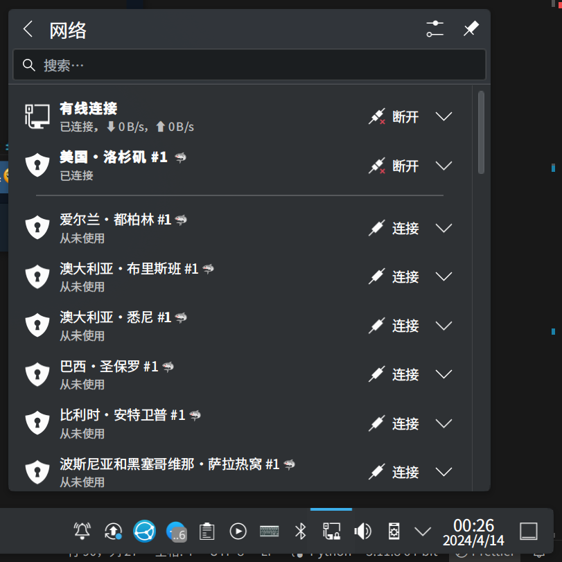

# Baby Shark

## 安装

```
sudo zypper install babyshark
```

## 运行

```
$ babyshark
📡 au-bne.prod.surfshark.com
   ✅ 144.48.39.133
   ❌ 144.48.39.11 ping 失败
📡 au-syd.prod.surfshark.com
   ✅ 149.88.101.24
   ❌ 45.248.76.227 ping 失败
📡 az-bak.prod.surfshark.com
   ❌ 45.39.203.20 ping 失败
   ❌ 45.39.203.34 ping 失败
```


